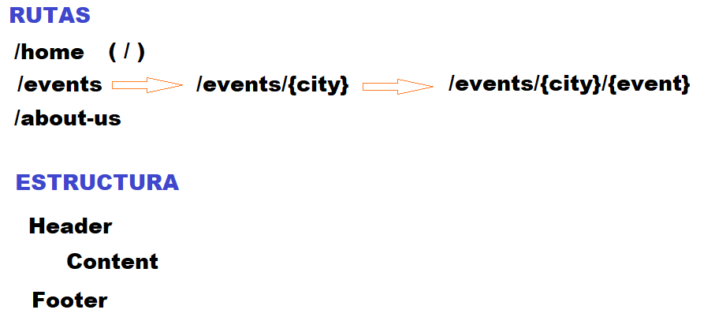

# Proyecto de Eventos - Next.js 16

## Pasos para crear el proyecto

1. Definir rutas/páginas y estructura del Layout


2. Crear un nuevo proyecto de Next.js con el comando:
```bash
npx create-next-app events-app
```

3. Crear las rutas `app/about`, `app/events/[city]/[eventId]`

4. En la carpeta `components/` Crear ***Navbar.tsx*** y ***Footer.tsx***, y usarlos en `app/layout.tsx`

5. Poner contenido en el `app/page.tsx`

6. Agregar el ***data.json*** en `data/data.json`

7. Obtener los datos de las ciudades y eventos de ***data.json*** y mostrarlos en `app/page.tsx`, `[city]/page.tsx` y `[ventId].tsx`

8. 